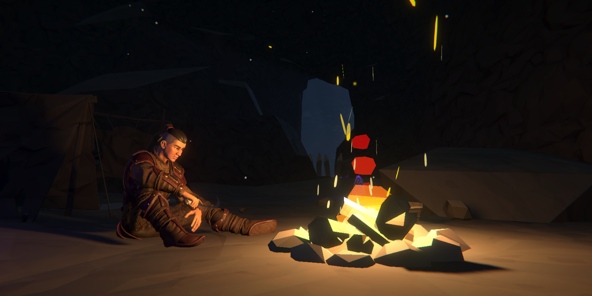
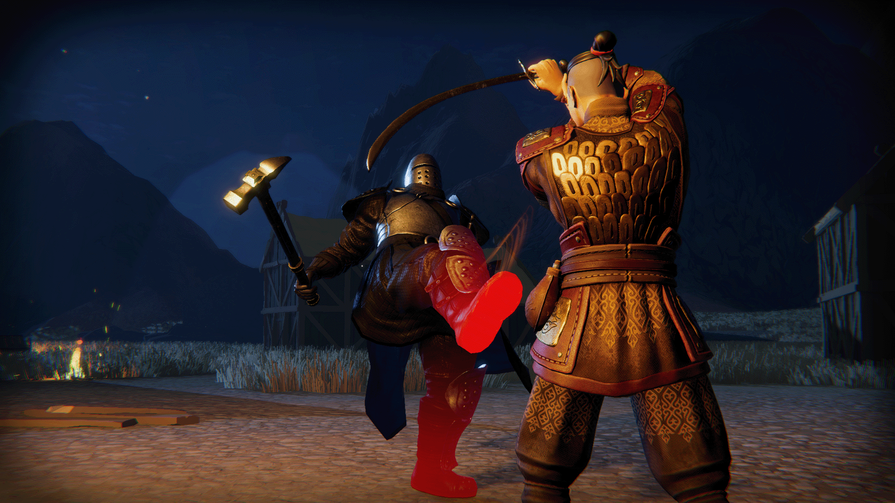

# ⚔️Project Steppe⚔️

---

For our final trimester of university, we were given full control over what type of game we could make. After having discussed it within our group, we settled on making a souls-like game.

## Cambridge Gamebridge

After finishing the game for the module, we had a meeting to figure out if we wanted to submit the game for Gamebridge, and if so, we would have to work on it to substancially improve it.

There were many areas that could be improved from the version we submitted for uni, and these were the first areas we focused on, reducing the map size, rewriting how the AI works and much more.

I was in charge of much of the mechanic reworks and rewrites. One of the biggest tasks that I was tasked with doing was completely rewrite how the AI in the game works behind the scenes, the previous AI system was written by another team member, and it worked for the previous version of the game, but for the Gamebridge version we needed a much more robust system that could handle a much more complex boss and enemies that are able to more easily adapt to the player and what they are doing.

Along the AI, I worked on improving:
- **Enemies**: Adding support to have multiple enemies and how to handle that in the backend
- **Target Locking**: Improving both how the camera rotates and moves when locked on, as well as being able to switch targets